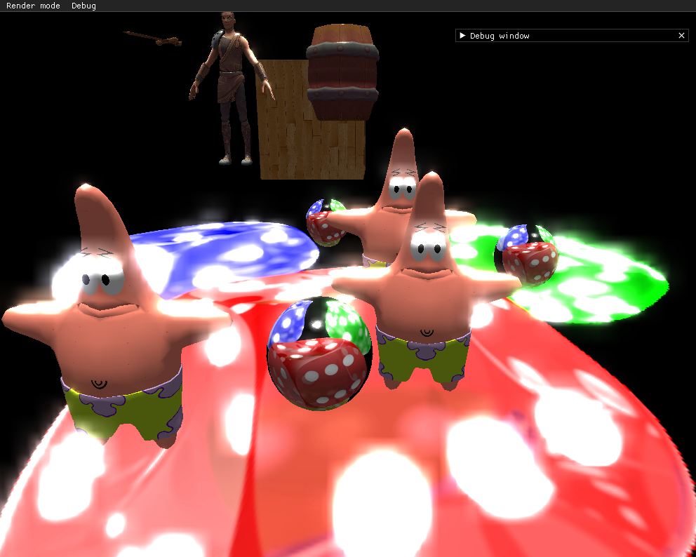
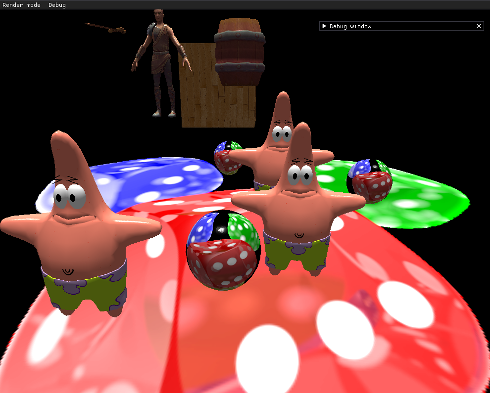
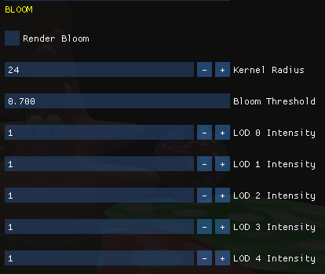
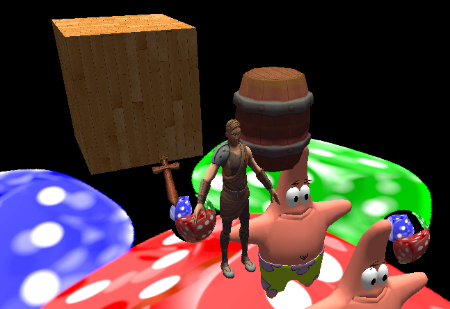
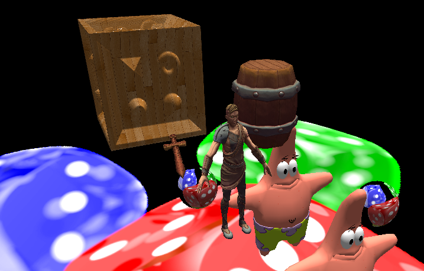

# OGLEngine

by Aitor Simona & Daniel Lorenzo

## New Techniques:

### Bloom

Through the debug window, you can configure the blur kernel radius, the bloom brightest threshold and
the blur LODs intensities:

Uses BLOOM / BLOOM_BLUR and BLOOM_BRIGHTEST shaders

### Relief mapping

Using the debug window, the user can enable and disable both the normal mapping and the relief mapping. Besides, 
the user can also modify the bumpiness of the cube model (since it is the only one that has a relief map), 
as seen in the following picture:

Relief mapping is implemented on top of both forward and deferred renderer techniques, so it uses SHOW_TEXTURED_MESH
and GEOMETRY_PASS shaders

## Work Distribution:

Aitor:

	- Deferred renderer
	- Shaders 
	- Entities / lights
	- Framebuffer (shaders relationship & texture fill)
	- Bloom

Dani:

	- Framebuffer (API)
	- WASD and orbit camera controls
	- Editor support (imgui)
	- Entity realtime movement
	- Relief mapping
	
